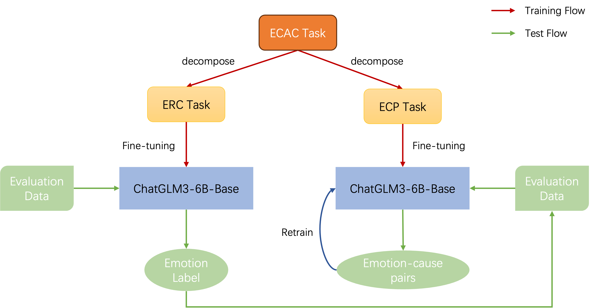

# NUS-Emo-at-SemEval-2024-Task3

This repository is the NUS-Emo team's system implementation for SemEval-2024 Task3
## System Overview

## Preparation
- Download the base model of ChatGLM3-6B-Base from https://huggingface.co/THUDM/chatglm3-6b/tree/main and place it in the 
`ChatGLM3/ChatGLM3-6B-Base` folder.
- Install the required packages by `pip install -r requirements.txt`

## Evaluation
We provide the pre-trained checkpoint under the `ChatGLM3\ChatGLM_LoRA` directionary and the evaluation dataset under the `data` directionary. If you want to evaluate our system directly on the evaluation dataset, please run `inference.py`, and the prediction results will be automatically saved in the `pred_results` folder.

## Train
We provide the pre-built ERC and ECP task for training ChatGLM3 under the `data` directionary. If you want to finetune the base model  by yourself, please follw the steps below:
- Run the ERC task fine-tuning script `.\scripts\erc_finetune_lora.sh`.
- Run the ECP task fine-tuning script `.\scripts\ecp_finetune_lora.sh`.
